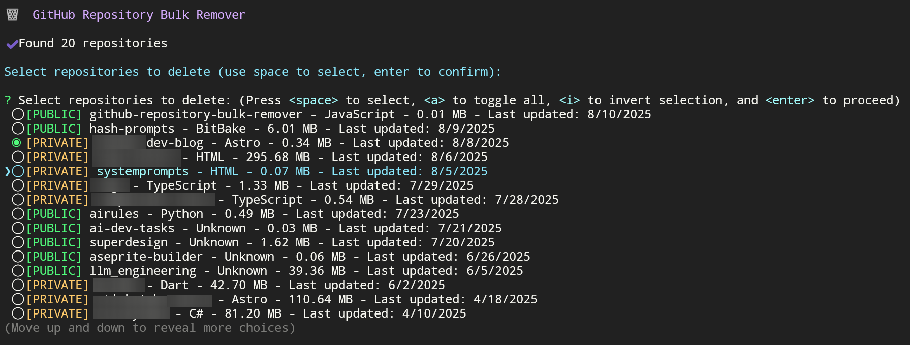

# GitHub Repository Bulk Remover

A TypeScript CLI tool to list and bulk delete GitHub repositories (both public and private) with an interactive checkbox interface.

⚠️ **WARNING**: This tool permanently deletes repositories. Use with extreme caution!




## Features

- Lists all your GitHub repositories (both public and private)
- Visual indicators for repository visibility ([PRIVATE] / [PUBLIC])
- Interactive checkbox selection (use space to select, enter to confirm)
- Shows repository details: name, language, size, and last update date
- Double confirmation before deletion to prevent accidents
- Progress tracking with visual feedback
- Detailed error messages with helpful guidance

## Prerequisites

- Node.js 16 or higher
- npm or yarn package manager
- GitHub Personal Access Token with `delete_repo` scope

## Installation

1. Clone the repository:
   ```bash
   git clone https://github.com/yourusername/github-repository-bulk-remover.git
   cd github-repository-bulk-remover
   ```

2. Install dependencies:
   ```bash
   npm install
   ```

3. Build the TypeScript code:
   ```bash
   npm run build
   ```

## Setup

1. Create a GitHub Personal Access Token:
   - Go to [GitHub Settings → Developer settings → Personal access tokens](https://github.com/settings/tokens)
   - Click "Generate new token (classic)"
   - Add a descriptive note (e.g., "Repository Bulk Remover")
   - Select the `delete_repo` scope (required for deletion)
   - Optionally select `repo` scope for private repository access
   - Copy the generated token immediately (you won't see it again)

2. Export the token as an environment variable:
   ```bash
   export GITHUB_ACCESS_TOKEN="your_token_here"
   ```

   Or add it to your shell profile for persistence:
   ```bash
   echo 'export GITHUB_ACCESS_TOKEN="your_token_here"' >> ~/.bashrc
   source ~/.bashrc
   ```

## Usage

Run the tool after building:
```bash
npm start
```

Or use the development command (builds and runs):
```bash
npm run dev
```

You can also run directly:
```bash
node dist/index.js
```

## How it works

1. **Fetch**: The tool fetches all your repositories (both public and private)
2. **Display**: Shows repositories in an interactive checkbox list with details:
   - Visibility indicator ([PRIVATE] or [PUBLIC])
   - Repository name
   - Primary language
   - Size in MB
   - Last updated date
3. **Select**: Use keyboard controls:
   - `Space` - Select/deselect individual repositories
   - `a` - Toggle all repositories
   - `i` - Invert selection
   - `↑/↓` - Navigate through the list
   - `Enter` - Confirm selection
4. **Confirm**: Two confirmation prompts ensure you really want to delete
5. **Delete**: Processes each deletion with progress tracking
6. **Report**: Shows summary of successful and failed deletions

## Safety Features

- Lists both public and private repositories with clear visibility indicators
- Requires explicit selection of repositories to delete
- Double confirmation before any deletion
- Clear warnings about the irreversible nature of deletion
- Detailed error messages if something goes wrong

## API Information

The tool uses the GitHub REST API v3 with the following endpoints:
- `GET /user/repos` - List repositories
- `DELETE /repos/{owner}/{repo}` - Delete a repository

## Important Notes

- Deleting a repository is **permanent** and cannot be undone
- Deleting a repository will also delete all its forks
- Be extra careful when deleting public repositories as they may be used by others
- You need appropriate permissions to delete repositories
- The token must have the `delete_repo` scope

## Error Handling

The tool provides clear error messages for common issues:
- Missing or invalid token
- Insufficient permissions
- Network errors
- API rate limiting

## Development

### Available Scripts

```bash
# Install dependencies
npm install

# Build TypeScript to JavaScript
npm run build

# Build and run in one command
npm run dev

# Run the compiled application
npm start

# Clean build artifacts
npm run clean
```

### Project Structure

```
github-repository-bulk-remover/
├── src/
│   └── index.ts       # Main application source code
├── dist/              # Compiled JavaScript (generated after build)
│   └── index.js
├── package.json       # Project configuration and scripts
├── tsconfig.json      # TypeScript configuration
└── README.md          # This file
```

### TypeScript Configuration

The project uses TypeScript with the following key settings:
- Target: ES2022
- Module: CommonJS
- Strict mode enabled
- Source directory: `./src`
- Output directory: `./dist`

## Troubleshooting

### "Cannot find module" error when running `npm start`
**Solution**: Run `npm run build` first to compile the TypeScript code.

### "GITHUB_ACCESS_TOKEN environment variable is not set"
**Solution**: Export your GitHub token: `export GITHUB_ACCESS_TOKEN="your_token_here"`

### "401 Unauthorized" error
**Solution**: Check that your token is valid and has the necessary permissions.

### "403 Forbidden" when deleting
**Solution**: Ensure your token has the `delete_repo` scope.

## License

ISC
